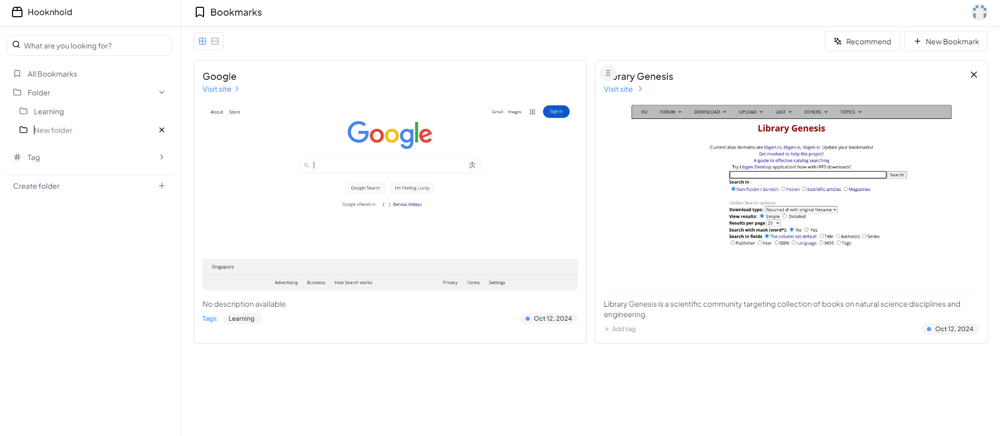

# HooknHold

HooknHold is an open-source project built with [Next.js](https://nextjs.org/) that empowers users to efficiently bookmark, organize, and manage their favorite web content.



## Features

- **Smart Bookmarking**: Easily save and categorize web pages with automatic metadata extraction.
- **Intuitive Organization**: Create custom folders and tags for effortless content management.
- **Drag-and-Drop Interface**: Seamlessly reorganize bookmarks and folders with a user-friendly drag-and-drop system.
- **Full Search**: Quickly find your bookmarks.

## Getting Started

### Prerequisites

- Node.js
- pnpm, npm, or yarn
- PostgreSQL database
- AWS S3 bucket (optional, for cloud storage)
- GitHub account (for OAuth)

### Installation

1. Clone the repository:
   ```bash
   git clone https://github.com/dendianugerah/hooknhold.git
   cd hooknhold
   ```

2. Install dependencies:
   ```bash
   pnpm install
   # or
   npm install
   # or
   yarn install
   ```

3. Set up environment variables:
   Copy the `.env.example` file to `.env` and fill in the required values.

4. Run database migrations:
   ```bash
   pnpm run migrate
   # or
   npm run migrate
   # or
   yarn migrate
   ```

5. Start the development server:
   ```bash
   pnpm run dev
   # or
   npm run dev
   # or
   yarn dev
   ```

6. Open [http://localhost:3002](http://localhost:3002) with your browser to see the result.

## Usage

1. Sign in with your GitHub account.
2. Add bookmarks by pasting URLs or using the "Add Bookmark" button.
3. Organize your bookmarks into folders and add tags for easy categorization.
4. Use the search function to quickly find specific bookmarks.
5. Drag and drop bookmarks to rearrange or move them between folders.

## Tech Stack

- [Next.js](https://nextjs.org/) - React framework for server-side rendering and static site generation
- [NextAuth.js](https://next-auth.js.org/) - Authentication for Next.js applications
- [Drizzle ORM](https://orm.drizzle.team/) - TypeScript ORM for SQL databases
- [PostgreSQL](https://www.postgresql.org/) - Open-source relational database
- [AWS S3](https://aws.amazon.com/s3/) - Cloud object storage (mandatory for now)
- [TypeScript](https://www.typescriptlang.org/) - Typed superset of JavaScript
- [Tailwind CSS](https://tailwindcss.com/) - Utility-first CSS framework

## Upcoming Features

- [ ] Hybrid storage system: Option to store bookmarks in local directory or AWS S3
- [ ] Browser extension for quick bookmarking
- [ ] Sharing bookmarks with other users
- [ ] AI-powered website recommendations based on bookmark history
- [ ] Code refactoring for improved performance and maintainability
- [ ] Comprehensive API documentation
- [ ] Integration tests for core functionalities
